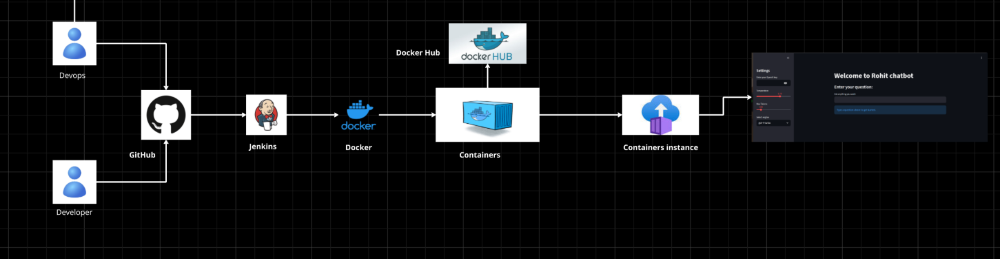

# Building a chat bot and containerising the application and push the image to dockerhub

# How to Create a Virtual Environment on Linux

## Steps

1. **Open Terminal**

2. **Navigate to your project directory** (or where you want the virtual environment to be created):
   ```bash
   cd /path/to/your/project
   ```   
3. **Create the virtual environment:**
   ```bash
   python3.12 -m venv pythonclass-py-3.12
   python3 -m venv pythonclass-py-3.12
   ``` 
4. **Activate the virtual environment:**
   ```bash
   source pythonclass-py-3.12/bin/activate
   ```    
5. **Verify Python version inside the virtual environment:**   
    ```bash
    python --version
    ```
6. **Install any necessary packages:**
   ```bash
   pip install -r requirements.txt
   ```
7. **Deactivate the virtual environment:**
    ```bash
    deactivate
    ```
==================
**FLOW CHART**



**Final Output**


